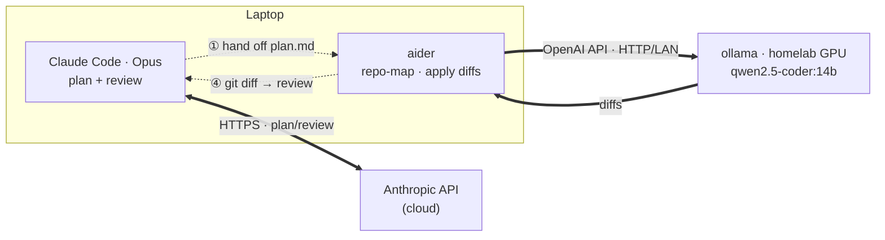

# Local-AI Offload

Cut Claude (cloud) token spend by offloading bulk implementation to a local model
on the homelab GPU. **Claude Code plans + reviews (cloud); aider + a local model
implement (homelab GPU).** Two separate tools, two direct connections — no proxy,
no router.

---

## Architecture



*Solid = live network connections. Dashed = the manual handoff of artifacts between the two tools.*

- **Claude Code** — the expensive brain. Talks **directly** to `api.anthropic.com`.
  Plans + reviews only. Low token volume.
- **aider** — the local editor. Talks **directly** to ollama (OpenAI-compatible API).
  Builds a repo-map, sends the task + relevant code, applies returned diffs, can run
  tests/lint in a loop.
- **ollama** — serves the local model on the GPU. Free inference.

---

## How the handoff works (plan → implement → review)

The switch between cloud and local is **explicit and manual** — you move between two
tools, and each stays in its lane: Claude Code never touches the local model; aider
never touches Anthropic.

| Phase | Tool → connection | Cost | What happens |
|---|---|---|---|
| ① Plan | Claude Code → Anthropic (HTTPS) | small $ | Describe the task; Opus writes a short `plan.md`. |
| ② Implement | aider → ollama (HTTP/LAN) | free | `aider --message-file plan.md <files>`; local model edits + applies diffs. |
| ③ Execute / test | aider (local shell) or you | free | aider can run a test/lint command in-loop (`--test-cmd`) and self-fix. |
| ④ Review | Claude Code → Anthropic (HTTPS) | small $ | `git diff`; Opus validates, finds bugs, requests fixes → back to ②. |

Loop ②–④ until it passes, then commit. **Claude only ever sees the plan and the
diffs — never the token-heavy edit loop.**

**Connections at a glance**
- Claude Code → `api.anthropic.com` — your Claude auth, HTTPS. Direct.
- aider → `OLLAMA_API_BASE` (e.g. `http://<lan-ip>:11434`) — OpenAI-compatible, plain
  HTTP on the LAN. Direct.
- ollama → GPU — local, in-cluster on the GPU worker node.

There is **no automatic routing**: *you* decide which tool runs each phase. That is
the whole point — Claude tokens stay limited to plan+review, while the bulk runs on
the free local GPU.

---

## Setup

### 1. Cluster (once, GitOps — serves every repo)

ollama, the model, and the LAN endpoint are declared in the **homelab repo**
(CDK8s → ArgoCD), not here:

- model pulled declaratively (`ollama.models.pull: [qwen2.5-coder:14b]`)
- Service `type: LoadBalancer` → Cilium LB-IPAM assigns a stable `192.168.1.x` LAN IP

Verify after ArgoCD syncs:

```bash
kubectl -n ollama exec deploy/ollama -- ollama list                                  # model present
kubectl -n ollama get svc ollama -o jsonpath='{.status.loadBalancer.ingress[0].ip}'  # LAN IP
```

No LoadBalancer yet? Temporary: `kubectl -n ollama port-forward svc/ollama 11434:11434`
→ `http://localhost:11434`. (Ad-hoc extra role models:
`OLLAMA_HOST=http://<lan-ip>:11434 ./ollama/sync-models.sh`.)

### 2. Per-repo (start here)

Drop three files in a repo — no global config needed. This repo ships them as
working examples.

**`.aider.conf.yml`** (commit it — shared with collaborators):

```yaml
model: ollama/qwen2.5-coder:14b
edit-format: diff        # smaller diffs = fewer tokens
auto-commits: false      # review before committing
map-tokens: 1024         # cap repo-map size
```

**`.env`** (gitignored — holds the endpoint; copy from `.env.example`):

```bash
OLLAMA_API_BASE=http://<ollama-lan-ip>:11434   # or http://localhost:11434 via port-forward
```

aider auto-loads `.env` from the repo root; `.env` is gitignored so endpoints stay
out of git.

**`.aiderignore`** (commit it — keeps the repo-map small, fewer tokens):

```
node_modules/
dist/
vendor/
*.lock
```

Install + run:

```bash
uv tool install aider-chat   # once per machine (uv tool upgrade aider-chat to update)
aider <files>                # uses repo .aider.conf.yml + .env
```

### 3. Global (optional — once you want it everywhere)

Promote the per-repo config to machine defaults so a bare `aider` works in any repo:

- `~/.aider.conf.yml` — same keys as §2
- `~/.zshrc`: `export OLLAMA_API_BASE=http://<ollama-lan-ip>:11434`
- (optional) `~/.claude/CLAUDE.md` — tell Claude to default to the
  plan → aider → review workflow:

  ```markdown
  ## Local-model offload
  For implementation, write a concise plan.md, then hand it to local aider
  (`aider --message-file plan.md <files>`) running on the homelab GPU. I (Claude)
  plan and review the diff — I do not write the bulk implementation unless asked.
  ```

Per-repo config (§2) **overrides** global.

---

## Daily workflow

1. **Claude Code (Opus):** describe the task → produce a short `plan.md`.
2. **Implement (free):** `aider --message-file plan.md <files>` → local model edits.
3. **Review:** `git diff` → Claude validates / runs tests → fix loop (repeat 2).
4. **Commit** when it passes.

---

## Model selection (RTX 5070 Ti, 16 GB shared VRAM)

| Model | Fit | Use |
|---|---|---|
| `qwen2.5-coder:14b` | ~9–13 GB ✅ | default coder, reliable |
| `gpt-oss:20b` | ~12–14 GB ✅ | strong agentic/tool-use |
| `qwen2.5-coder:7b` | ~6–7 GB ✅ | fast, large context, low-VRAM |
| `qwen3-coder-next` | ❌ | needs ~40 GB+ RAM offload (node has 15.6 GB) |
| `GLM-5.2`, `qwen2.5-coder:32b` | ❌ | too big — cloud/API only |

Switch per invocation: `aider --model ollama/gpt-oss:20b`.

---

## Troubleshooting

| Symptom | Cause / fix |
|---|---|
| aider can't connect | `curl $OLLAMA_API_BASE/api/tags` → 200? If not: port-forward down, or wrong LAN IP. |
| `model not found` | Pull it: `kubectl -n ollama exec deploy/ollama -- ollama pull <model>` |
| Slow / CPU-bound | Model spilled past 16 GB VRAM. Use a smaller tag; check `nvidia-smi` on the GPU node. |
| OOM on model load | ollama pod RAM too low — bump request/limit in the homelab manifest. |
| aider edits too much context | add `.aiderignore`, lower `map-tokens`. |

---

> Endpoints shown as `<ollama-lan-ip>` are placeholders — keep homelab IPs/domains out of git.
