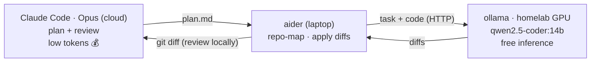

# Local-AI Offload

Reduce Claude (cloud) token spend by offloading bulk implementation to a local
model on the homelab GPU. **Claude plans + reviews; a local model (via aider →
ollama) implements.** The token-heavy edit loop runs on the free local GPU;
Claude only handles the plan and the final diff review.

---

## Architecture



- **Claude** — expensive brain. Plans + reviews only. Low token volume.
- **aider** — harness that does the editing: repo-map, sends task + relevant code
  to a model, applies returned diffs, can run tests/lint in a loop.
- **ollama** — serves the local model over HTTP on the GPU. Free inference.
- **LiteLLM** — *optional* router (budget caps, mixing cloud+local). Not required
  for the aider→ollama path.

**What lives where:**

| Layer | Scope | Set up |
|---|---|---|
| ollama + pulled models | **cluster — shared by ALL repos** | once |
| aider install + `~/.aider.conf.yml` | **laptop — global** | once |
| LAN reachability (LoadBalancer IP) | **global** | once |
| `.aider.conf.yml` inside a repo | **per-repo (optional override)** | as needed |
| plan→aider→review workflow | habit / `~/.claude/CLAUDE.md` | optional |

> You do **not** copy this repo into every project. This repo is cluster
> scaffolding (deploy-once). "Global" = configure the laptop + expose ollama on LAN.

---

## 1. One-time cluster setup (serves every repo)

Models live on the GPU node and serve all repos.

```bash
# Pull/refresh role models on the running Ollama (also pulls the base):
OLLAMA_HOST=http://<ollama-lan-ip>:11434 ./ollama/sync-models.sh

# Verify:
kubectl -n ollama exec deploy/ollama -- ollama list   # expect qwen2.5-coder:14b + role models
```

**Stable LAN access (recommended).** Set the ollama Service to
`type: LoadBalancer` (manifest in the homelab repo). Cilium LB-IPAM assigns a
`192.168.1.x` IP — one endpoint, every repo, no port-forward.

```yaml
# ollama Service (homelab repo)
spec:
  type: LoadBalancer   # Cilium LB-IPAM → 192.168.1.x
```

Find the assigned IP:

```bash
kubectl -n ollama get svc ollama -o jsonpath='{.status.loadBalancer.ingress[0].ip}'
```

**No LoadBalancer?** Use a per-session port-forward (one terminal serves all repos):

```bash
kubectl -n ollama port-forward svc/ollama 11434:11434   # endpoint: http://localhost:11434
```

---

## 2. Global laptop setup (use in ANY repo)

Install aider once:

```bash
pipx install aider-chat        # or: brew install aider
```

Global config — **`~/.aider.conf.yml`**:

```yaml
model: ollama/qwen2.5-coder:14b
edit-format: diff        # smaller outputs
auto-commits: false      # review before committing
map-tokens: 1024         # cap repo-map size
```

Point aider at ollama — add to **`~/.zshrc`**:

```bash
export OLLAMA_API_BASE=http://<ollama-lan-ip>:11434   # or http://localhost:11434 via port-forward
```

Reload: `source ~/.zshrc`. Now in **any repo**:

```bash
aider <files>            # picks up global config + endpoint automatically
```

**Optional — make Claude default to the workflow.** Add to `~/.claude/CLAUDE.md`:

```markdown
## Local-model offload
For implementation, prefer: write a concise plan.md, then hand it to local
aider (`aider --message-file plan.md <files>`) which runs qwen2.5-coder on the
homelab GPU. I (Claude) plan and review the resulting diff — I do not write the
bulk implementation myself unless asked.
```

---

## 3. Per-repo setup

Drop three files in any repo to use the local model there — no global config
needed. This repo ships them as working examples.

**`.aider.conf.yml`** (commit it — shared with collaborators):

```yaml
model: ollama/qwen2.5-coder:14b
edit-format: diff        # smaller diffs = fewer tokens
auto-commits: false      # review before committing
map-tokens: 1024         # cap repo-map size
```

**`.env`** (gitignored — holds the endpoint; copy from `.env.example`):

```bash
OLLAMA_API_BASE=http://<ollama-lan-ip>:11434   # or http://localhost:11434 via port-forward
```

aider auto-loads `.env` from the repo root. `.env` is already in `.gitignore`,
so endpoints stay out of git.

**`.aiderignore`** (commit it — keeps the repo-map small, fewer tokens):

```
node_modules/
dist/
vendor/
*.lock
```

Then, inside the repo:

```bash
pipx install aider-chat   # once per machine
aider <files>             # uses repo .aider.conf.yml + .env
```

> Per-repo config **overrides** any global `~/.aider.conf.yml`. Start per-repo;
> promote to global (§2) once you want it everywhere.

---

## 4. Daily workflow (any repo)

1. **Claude Code (Opus):** describe the task → produce a short `plan.md`.
2. **Implement locally (free):**
   ```bash
   aider --message-file plan.md path/to/files
   ```
3. **Review:** `git diff` → Claude validates / runs tests → fix loop (repeat step 2).
4. **Commit** when it passes.

---

## Model selection (RTX 5070 Ti, 16 GB shared VRAM)

| Model | Fit | Use |
|---|---|---|
| `qwen2.5-coder:14b` | ~9–13 GB ✅ | default coder, reliable |
| `gpt-oss:20b` | ~12–14 GB ✅ | strong agentic/tool-use |
| `qwen2.5-coder:7b` | ~6–7 GB ✅ | fast, large context, low-VRAM |
| `qwen3-coder-next` | ❌ | needs ~40 GB+ RAM offload (node has 15.6 GB) |
| `GLM-5.2`, `qwen2.5-coder:32b` | ❌ | too big — cloud/API only |

Switch per invocation: `aider --model ollama/gpt-oss:20b`.

---

## Troubleshooting

| Symptom | Cause / fix |
|---|---|
| aider can't connect | `curl $OLLAMA_API_BASE/api/tags` → 200? If not: port-forward down, or wrong LAN IP. |
| `model not found` | Pull it: `kubectl -n ollama exec deploy/ollama -- ollama pull <model>` |
| Slow / CPU-bound | Model spilled past 16 GB VRAM. Use a smaller tag; check `nvidia-smi` on the GPU node. |
| OOM on model load | ollama pod RAM too low — bump request/limit in the homelab manifest. |
| aider edits too much context | add `.aiderignore`, lower `map-tokens`. |

---

> Endpoints shown as `<ollama-lan-ip>` are placeholders — keep homelab IPs/domains
> out of git. LiteLLM (`litellm/config.yaml`) is optional: only deploy it for a
> unified cloud+local endpoint with budget caps.
